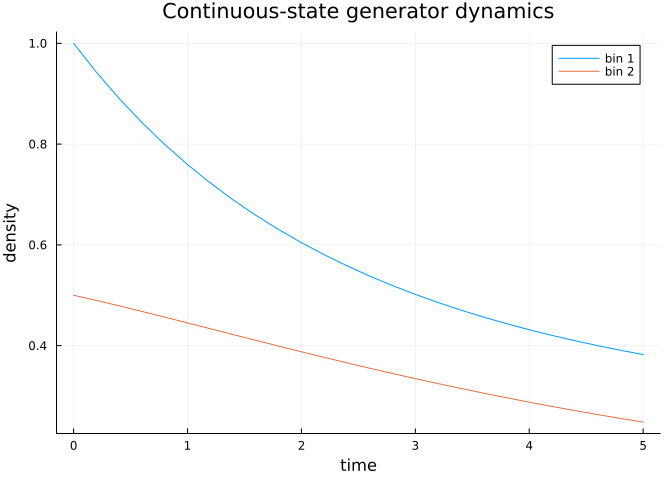
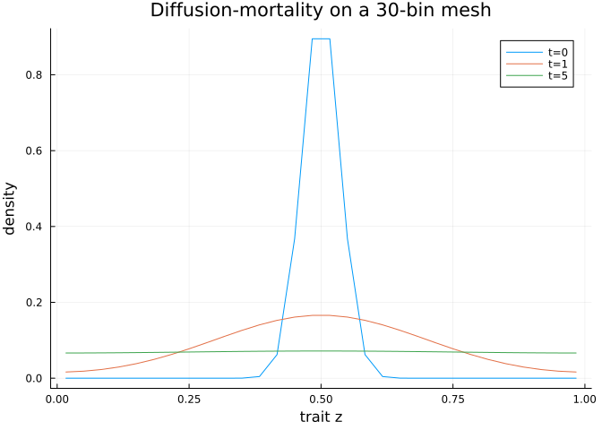

# Introduction to continuous-state continuous-time IPMs
Simon Frost

- [Overview](#overview)
- [Setup](#setup)
- [A discretised continuous-state
  generator](#a-discretised-continuous-state-generator)
- [Lowering and solving](#lowering-and-solving)
- [`remake` and dispatch
  restrictions](#remake-and-dispatch-restrictions)
- [A more biologically motivated
  generator](#a-more-biologically-motivated-generator)
- [Summary](#summary)

## Overview

**ContinuousStatePopulationDynamics.jl** holds the deterministic
continuous-time, continuous-state IPM machinery — the generator, delay,
and PSPM transport layers. Densities $n(z, t)$ live on a continuous
trait domain and evolve according to

$$\frac{\partial n}{\partial t} = G(z, z')\, n(z, t) + s(z, t),$$

discretised onto a mesh and lowered to SciML `ODEProblem`s (or
`DDEProblem`s) for integration with `OrdinaryDiffEq`.

This vignette introduces the core problem type `ContinuousIPMProblem`
and the supporting domain/structure/semantic types. Later vignettes
cover delays (vignette 02) and PSPM transport (vignette 03).

## Setup

``` julia
using ContinuousStatePopulationDynamics
using StructuredPopulationCore
using OrdinaryDiffEq
using Plots
```

Semantic markers:

``` julia
ContinuousState() isa AbstractStateSemantics, FiniteState() isa AbstractStateSemantics
```

    (true, true)

``` julia
ContinuousTime() isa AbstractTimeSemantics, DiscreteTime() isa AbstractTimeSemantics
```

    (true, true)

Structure traits classify the IPM topology:

``` julia
SimpleIPM() isa AbstractIPMStructure,
GeneralIPM() isa AbstractIPMStructure,
SimpleContinuousState() isa AbstractContinuousStateStructure,
GeneralContinuousState() isa AbstractContinuousStateStructure,
SimpleIPM() isa AbstractProjectionStructure
```

    (true, true, true, true, true)

## A discretised continuous-state generator

`ContinuousDomain(lo, hi, n)` builds an evenly spaced mesh:

``` julia
domain = ContinuousDomain(0.0, 1.0, 4)
domain isa AbstractStateDomain, n_states(domain), bounds(domain), step_size(domain)
```

    (true, 4, [0.0, 0.25, 0.5, 0.75, 1.0], 0.25)

``` julia
meshpoints(domain)
```

    4-element Vector{Float64}:
     0.125
     0.375
     0.625
     0.875

The generator matrix here is the discretised version of a continuous
operator. We use a small 2-point demo to keep the matrix legible. A
banded down-shift moves mass toward higher $z$ at constant rate:

``` julia
domain2 = ContinuousDomain(0.0, 1.0, 2)
G = [-0.5  0.2;
      0.1 -0.3]
u0 = [1.0, 0.5]
prob = ContinuousIPMProblem(G, domain2, u0, (0.0, 5.0); source = [0.1, 0.0])
prob isa AbstractContinuousIPMProblem,
prob isa AbstractContinuousStateDynamicsProblem
```

    (true, true)

## Lowering and solving

``` julia
odeprob = to_ode_problem(prob)
sol = solve(odeprob, Tsit5(); saveat = 0.2)
plot(sol.t, hcat(sol.u...)'; labels = ["bin 1" "bin 2"],
     xlabel = "time", ylabel = "density",
     title = "Continuous-state generator dynamics")
```



`solve` dispatches directly on the IPM problem too:

``` julia
sol_direct = solve(prob, Tsit5(); saveat = 5.0)
sol_direct.u[end]
```

    2-element Vector{Float64}:
     0.3822955556028332
     0.2481782164097129

## `remake` and dispatch restrictions

``` julia
prob_long = ContinuousStatePopulationDynamics.remake(prob; tspan = (0.0, 10.0))
prob_long.tspan
```

    (0.0, 10.0)

CSPD is continuous-time. Discrete-time iteration and direct
eigenanalysis throw `ArgumentError`:

``` julia
try
    solve(prob, DirectIteration())
catch err
    err
end
```

    ArgumentError("DirectIteration is not defined for ContinuousIPMProblem; use a SciML ODE algorithm instead.")

``` julia
try
    solve(prob, EigenAnalysis())
catch err
    err
end
```

    ArgumentError("EigenAnalysis is not defined for ContinuousIPMProblem; use to_ode_problem or a SciML ODE solve instead.")

## A more biologically motivated generator

A diffusion-like growth process on a finer mesh: probability mass
diffuses to neighbouring bins under a tridiagonal generator.

``` julia
n = 30
domain_fine = ContinuousDomain(0.0, 1.0, n)
zs = meshpoints(domain_fine)
dx = step_size(domain_fine)

D = 0.02  # diffusion coefficient
mu = 0.05 # uniform mortality

# Build a tridiagonal generator: discrete diffusion + mortality
G_diff = zeros(n, n)
for i in 1:n
    G_diff[i, i] -= mu
    if i > 1
        G_diff[i, i-1] += D / dx^2
        G_diff[i-1, i-1] -= D / dx^2
    end
    if i < n
        G_diff[i, i+1] += D / dx^2
        G_diff[i+1, i+1] -= D / dx^2
    end
end

n0 = exp.(-((zs .- 0.5) ./ 0.05).^2)  # narrow Gaussian centred at 0.5
prob_diff = ContinuousIPMProblem(G_diff, domain_fine, n0, (0.0, 5.0))
sol_diff = solve(to_ode_problem(prob_diff), Tsit5(); saveat = [0.0, 1.0, 5.0])

plot(zs, sol_diff.u; labels = ["t=0" "t=1" "t=5"],
     xlabel = "trait z", ylabel = "density",
     title = "Diffusion-mortality on a 30-bin mesh")
```



## Summary

- `ContinuousDomain` provides mesh, bounds, and step size.
- `ContinuousIPMProblem` wraps a generator + domain + initial density
  - tspan; lower with `to_ode_problem` or call `solve` directly.
- Abstract types (`AbstractContinuousIPMProblem`,
  `AbstractContinuousStateDynamicsProblem`,
  `AbstractContinuousStateStructure`, `AbstractIPMStructure`,
  `AbstractStateDomain`, `AbstractStateSemantics`,
  `AbstractTimeSemantics`, `AbstractProjectionStructure`) classify every
  concrete type.

CSPD also re-exports `DiscreteDomain` from `StructuredPopulationCore`
for parity with `FiniteStatePopulationDynamics.jl`; use it when a
problem mixes a continuous trait axis with a small discrete stage
classifier (e.g. juvenile/adult x size):

``` julia
DiscreteDomain([:juvenile, :adult]) isa AbstractStateDomain
```

    true
