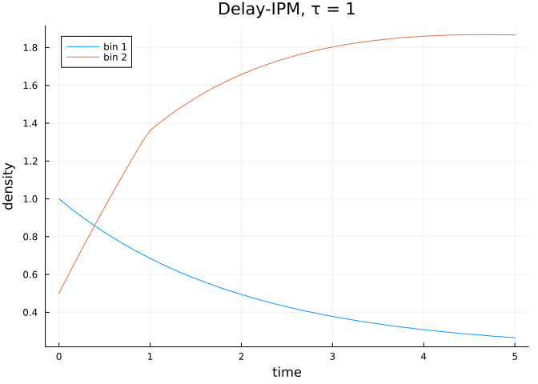
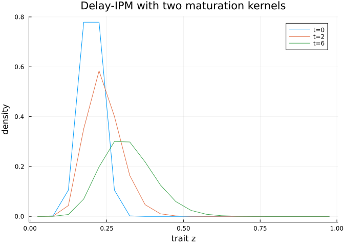

# Delay-IPM dynamics
Simon Frost

- [Overview](#overview)
- [Setup](#setup)
- [A two-bin delay-IPM](#a-two-bin-delay-ipm)
- [Lowering and solving](#lowering-and-solving)
- [Multiple delay kernels on a finer
  mesh](#multiple-delay-kernels-on-a-finer-mesh)
- [`remake` on delay problems](#remake-on-delay-problems)
- [Summary](#summary)

## Overview

A `DelayIPMProblem` adds delay-generator terms to a continuous-state
generator problem. The dynamics are

$$\frac{\partial n}{\partial t} = G(z, z')\, n(z, t) +
  \sum_k H_k(z, z')\, n(z, t - \tau_k) + s(z, t),$$

discretised onto a mesh and lowered to a SciML `DDEProblem` for solution
with `DelayDiffEq.MethodOfSteps`.

## Setup

``` julia
using ContinuousStatePopulationDynamics
using StructuredPopulationCore
using OrdinaryDiffEq
using DelayDiffEq
using Plots
```

## A two-bin delay-IPM

We retain a small mesh so the matrices stay legible. Mass leaks out of
bin 1 into bin 2 with a fixed delay:

``` julia
domain = ContinuousDomain(0.0, 1.0, 2)

G = [-0.5  0.0;
      0.2 -0.1]
H = [0.0 0.0;
     0.4 0.0]
delay = DelayGeneratorTerm(1.0, H)
delay isa DelayGeneratorTerm
```

    true

``` julia
history(p, t) = [2.0, 1.0]
prob = DelayIPMProblem(G, [delay], domain,
                        [1.0, 0.5], history, (0.0, 5.0);
                        source = [0.1, 0.0])
prob isa AbstractContinuousIPMProblem
```

    true

## Lowering and solving

``` julia
ddeprob = to_dde_problem(prob)
sol = solve(ddeprob, MethodOfSteps(Tsit5()); saveat = 0.1)
plot(sol.t, hcat(sol.u...)'; labels = ["bin 1" "bin 2"],
     xlabel = "time", ylabel = "density",
     title = "Delay-IPM, τ = 1")
```



The wrapper dispatches directly:

``` julia
sol_direct = solve(prob, MethodOfSteps(Tsit5()); saveat = 5.0)
sol_direct.u[end]
```

    2-element Vector{Float64}:
     0.26566805731921245
     1.8665475808243686

## Multiple delay kernels on a finer mesh

``` julia
n = 20
domain_fine = ContinuousDomain(0.0, 1.0, n)
zs = meshpoints(domain_fine)

# Instantaneous: uniform mortality plus a small drift up the trait axis
G_fine = zeros(n, n)
mu = 0.05
drift = 0.4
for i in 1:n
    G_fine[i, i] -= mu
    if i < n
        G_fine[i, i]   -= drift
        G_fine[i+1, i] += drift
    end
end

# Two delay kernels: short and long maturation pulses into bin n
H_short = zeros(n, n); H_short[n, 1] = 0.05
H_long  = zeros(n, n); H_long[n, 1]  = 0.10

prob_fine = DelayIPMProblem(
    G_fine,
    [DelayGeneratorTerm(1.0, H_short), DelayGeneratorTerm(3.0, H_long)],
    domain_fine,
    exp.(-((zs .- 0.2) ./ 0.05).^2),
    (p, t) -> exp.(-((zs .- 0.2) ./ 0.05).^2),
    (0.0, 6.0),
)
sol_fine = solve(to_dde_problem(prob_fine), MethodOfSteps(Tsit5());
                 saveat = [0.0, 2.0, 6.0])

plot(zs, sol_fine.u; labels = ["t=0" "t=2" "t=6"],
     xlabel = "trait z", ylabel = "density",
     title = "Delay-IPM with two maturation kernels")
```



## `remake` on delay problems

``` julia
prob_long = ContinuousStatePopulationDynamics.remake(prob; tspan = (0.0, 10.0))
prob_long.tspan
```

    (0.0, 10.0)

## Summary

- `DelayGeneratorTerm(τ, H)` and `DelayIPMProblem` extend the generator
  API with arbitrary delay kernels.
- `to_dde_problem` lowers to SciML; `MethodOfSteps(·)` integrates.
- The next vignette covers PSPM transport (`PSPMIPMProblem`,
  `FixedMeshUpwind`, `AbstractTransportDiscretization`).
